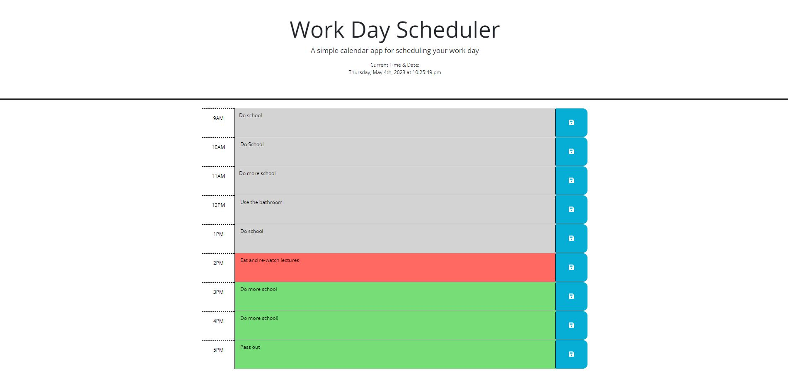

# EventCalander
This is a daily 9-5 planner. 

## General Information
- In this planner you can add events and save them to local storage to have them repeat daily.
- Adding a regular comment and not saving will save it until the next refresh of the page
- You can see a up to date time at the top including the date
- Depening if the event is in the past, present or future the blocks will change colors.

## Features
- Depening if the event is in the past, present or future the blocks will change colors.
- Typing in a event and saving it will save it to local storage!

## Screenshots / Links

Links to my deployed page! 

## Setup
N/A

## Usage
- To plan out your day

## Project Status
Project is: _complete_ 

## Room for Improvement

Room for improvement:
- Styling
- Add more time blocks

## Credit / Acknowledgements 
Took ideas from the UCSD coding boot camp folder

Learned how to add a image to the title bar from WBdocs https://www.w3docs.com/snippets/html/how-to-add-an-image-in-the-title-bar.html 

Big Props to Julious Dorfman for helping get the past, present and future to work properly

## Contact
Created by TristanM225 Reachout to me by email! TristanM225@gmail.com